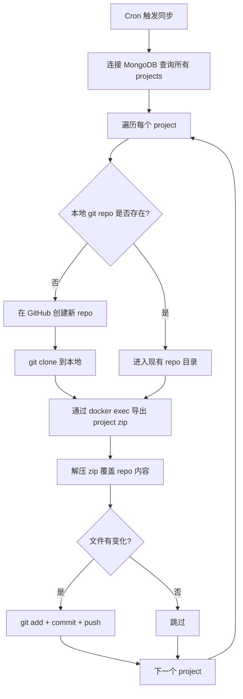

### overleaf-remote-deployment ###
在远端 Linux 服务器上部署 Overleaf 社区版，通过公网 IP + TLS NGINX 访问，并实现每个 Overleaf project 自动同步到独立 GitHub repo 的定时备份方案，支持多人协作。

# 远端服务器部署 Overleaf 社区版 + GitHub 多仓库同步方案

本方案将在远端 Linux 服务器上完整部署 Overleaf 社区版，配置 TLS NGINX 反向代理实现 HTTPS 公网访问，并通过定时脚本将每个 Overleaf project 自动同步到独立的 GitHub 仓库，实现持久化和多人协作。

## User Review Required

> [!IMPORTANT]
> 请确认以下信息，以便部署脚本生成正确的配置：
> 1. 远端服务器的公网 IP 地址（以下用 `YOUR_PUBLIC_IP` 占位）
> 2. 域名（如有，以下用 `YOUR_DOMAIN` 占位；如无域名则使用自签名证书）
> 3. GitHub Personal Access Token（用于自动 push）
> 4. 远端服务器的操作系统（本方案默认 Ubuntu 22.04+）

> [!WARNING]
> - TLS 证书：如无正式域名，将使用自签名证书，浏览器会显示安全警告
> - GitHub Token 需要 `repo` 权限
> - 服务器需要开放 80 和 443 端口

## Proposed Changes

### 1. 服务器环境准备脚本

#### [NEW] [01-server-setup.sh](file:///Users/dchen/Desktop/overleaf/.aone_copilot/plans/overleaf-remote-deployment/scripts/01-server-setup.sh)

服务器初始化脚本，安装 Docker、Docker Compose、git 等基础依赖。

```bash
# 核心步骤：
# 1. 更新系统包
# 2. 安装 Docker (官方源)
# 3. 安装 Docker Compose plugin
# 4. 安装 git, jq, unzip 等工具
# 5. 创建 overleaf 工作目录
# 6. 配置防火墙开放 80/443 端口
```

---

### 2. Overleaf Toolkit 部署与配置

#### [NEW] [02-deploy-overleaf.sh](file:///Users/dchen/Desktop/overleaf/.aone_copilot/plans/overleaf-remote-deployment/scripts/02-deploy-overleaf.sh)

克隆 toolkit 并初始化配置，核心配置如下：

**`config/overleaf.rc` 关键配置：**
```bash
PROJECT_NAME=overleaf
SERVER_PRO=false

# 数据持久化路径（绝对路径）
OVERLEAF_DATA_PATH=/opt/overleaf/data/sharelatex

# 监听配置 - 仅绑定 localhost，由 NGINX 代理
OVERLEAF_LISTEN_IP=127.0.0.1
OVERLEAF_PORT=8080

# MongoDB
MONGO_ENABLED=true
MONGO_DATA_PATH=/opt/overleaf/data/mongo

# Redis（开启 AOF 持久化）
REDIS_ENABLED=true
REDIS_DATA_PATH=/opt/overleaf/data/redis
REDIS_AOF_PERSISTENCE=true

# TLS NGINX 代理
NGINX_ENABLED=true
NGINX_HTTP_LISTEN_IP=0.0.0.0
NGINX_HTTP_PORT=80
NGINX_TLS_LISTEN_IP=0.0.0.0
TLS_PORT=443
```

**`config/variables.env` 关键配置：**
```bash
OVERLEAF_APP_NAME=My Overleaf
OVERLEAF_SITE_URL=https://YOUR_DOMAIN_OR_IP
OVERLEAF_NAV_TITLE=My Overleaf
OVERLEAF_ADMIN_EMAIL=admin@example.com
```

---

### 3. TLS 证书配置

#### [NEW] [03-setup-tls.sh](file:///Users/dchen/Desktop/overleaf/.aone_copilot/plans/overleaf-remote-deployment/scripts/03-setup-tls.sh)

两种模式：
- **有域名**：使用 Let's Encrypt (certbot) 自动申请免费证书
- **无域名**：生成自签名证书用于 HTTPS

```bash
# 自签名证书生成示例
openssl req -x509 -nodes -days 3650 \
  -newkey rsa:2048 \
  -keyout config/nginx/certs/overleaf_key.pem \
  -out config/nginx/certs/overleaf_certificate.pem \
  -subj "/CN=YOUR_DOMAIN_OR_IP"
```

---

### 4. GitHub 多仓库同步系统

这是本方案的核心创新部分。由于社区版不支持 Git Bridge，我们通过外部脚本实现：

#### [NEW] [04-setup-github-sync.sh](file:///Users/dchen/Desktop/overleaf/.aone_copilot/plans/overleaf-remote-deployment/scripts/04-setup-github-sync.sh)

安装同步系统的初始化脚本，创建目录结构、配置 GitHub 凭证。

#### [NEW] [overleaf-github-sync.sh](file:///Users/dchen/Desktop/overleaf/.aone_copilot/plans/overleaf-remote-deployment/scripts/overleaf-github-sync.sh)

核心同步脚本，工作流程：



**关键设计：**
- 使用 MongoDB 查询获取 project ID 和名称的映射
- 通过 `docker exec` 调用容器内的 `export-user-projects.mjs` 脚本按 project-id 导出
- 每个 project 对应 `/opt/overleaf/github-repos/<project-name>-<project-id>/` 目录
- 自动创建 GitHub repo（通过 GitHub API），命名格式：`overleaf-<project-name>`
- 维护一个 `project-repo-mapping.json` 配置文件记录映射关系

#### [NEW] [project-repo-mapping.json](file:///Users/dchen/Desktop/overleaf/.aone_copilot/plans/overleaf-remote-deployment/scripts/project-repo-mapping.json)

项目-仓库映射配置文件示例：
```json
{
  "github_org_or_user": "your-github-username",
  "default_visibility": "private",
  "projects": {}
}
```

---

### 5. 定时任务与服务管理

#### [NEW] [05-setup-cron.sh](file:///Users/dchen/Desktop/overleaf/.aone_copilot/plans/overleaf-remote-deployment/scripts/05-setup-cron.sh)

配置 cron 定时任务（默认每 30 分钟同步一次）和 systemd 服务。

---

### 6. 多人协作方案

#### [NEW] [06-setup-collaboration.sh](file:///Users/dchen/Desktop/overleaf/.aone_copilot/plans/overleaf-remote-deployment/scripts/06-setup-collaboration.sh)

- 批量创建用户脚本（通过 `docker exec` 调用 `create-user.mjs`）
- 协作工作流说明：
  - **在线协作**：多人通过浏览器访问同一个 Overleaf project（社区版支持基础协作）
  - **离线协作**：通过 GitHub repo 拉取最新 LaTeX 源码，本地编辑后提交 PR
  - **同步回 Overleaf**：提供反向导入脚本，将 GitHub 变更导回 Overleaf

---

### 7. 一键部署主脚本

#### [NEW] [deploy-all.sh](file:///Users/dchen/Desktop/overleaf/.aone_copilot/plans/overleaf-remote-deployment/scripts/deploy-all.sh)

一键执行以上所有步骤的主入口脚本，按顺序调用 01-06 脚本。支持参数化配置：
```bash
./deploy-all.sh \
  --domain YOUR_DOMAIN \
  --ip YOUR_PUBLIC_IP \
  --github-token ghp_xxxx \
  --github-user your-username \
  --admin-email admin@example.com \
  --sync-interval 30
```

## Verification Plan

### Automated Tests
```bash
# 1. 检查 Docker 服务状态
docker compose ps

# 2. 检查 Overleaf 是否可访问
curl -k https://YOUR_DOMAIN_OR_IP/

# 3. 检查 TLS 证书
openssl s_client -connect YOUR_DOMAIN_OR_IP:443 -servername YOUR_DOMAIN_OR_IP

# 4. 检查 MongoDB 连通性
docker exec mongo mongosh --eval "db.adminCommand('ping')"

# 5. 手动触发一次 GitHub 同步并检查结果
/opt/overleaf/scripts/overleaf-github-sync.sh --dry-run
```

### Manual Verification
- 用户在浏览器中通过 `https://YOUR_DOMAIN_OR_IP` 访问 Overleaf
- 创建管理员账号（`https://YOUR_DOMAIN_OR_IP/launchpad`）
- 创建测试 project，等待同步后检查对应 GitHub repo 是否有内容
- 邀请第二个用户加入 project 进行协作测试


updateAtTime: 2026/5/7 10:38:49

planId: abbd708b-8406-4a32-8b1f-75f7614c0ddf